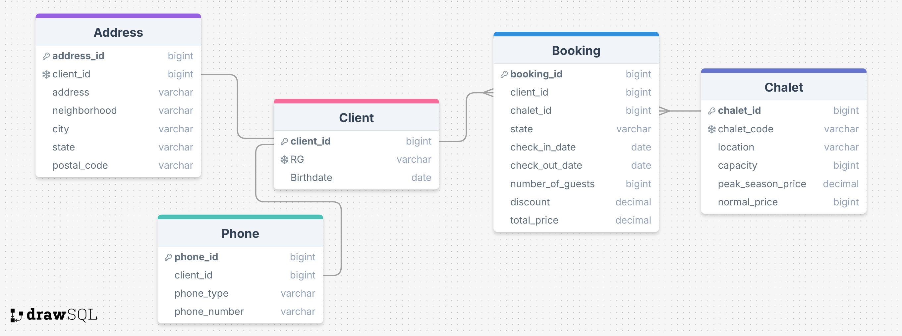

# Chalet Management System

This project is designed to help manage chalet bookings, clients, and related information efficiently.

## Introduction

The Chalet Management System is a comprehensive solution for managing chalet bookings, client information, and related data. It provides an easy-to-use interface for administrators to handle various operations such as adding clients, managing bookings, and updating chalet information.

## Features

- **Client Management**: Add, update, and view client information.
- **Chalet Management**: Manage chalet details including location, capacity, and pricing.
- **Booking Management**: Handle chalet bookings, including check-in and check-out dates, number of guests, and discounts.
- **Address and Phone Management**: Store and manage client addresses and phone numbers.

## Setup

To set up the Chalet Management System, follow these steps:

1. **Clone the repository**:
    ~~~sh
    git clone https://github.com/Thurzinhu/ChaletSystem.git
    ~~~

    ~~~sh
    cd ChaletSystem
    ~~~

2. **Set up the database**:
    - Create a PostgreSQL database named `chalet_heaven`.
    - Run the [`schema.sql`](./database/schema.sql) file to create the necessary tables:

~~~sh
psql -U your_username -d chalet_heaven -f path/to/schema.sql
~~~

3. **Configure the application**:
    - Update the database connection settings in the application [`configuration file`](./src/br/com/chaletmanagement/context/ConnectionFactory.java).

4. **Run the application**:
    - Use your preferred IDE or build tool to run the application.

  ## Testing
 - Optionally, run the [`insert.sql`](./database/insert.sql) file to insert test data. This will allow you to verify that the application is working correctly with the test data.
~~~sh
psql -U your_username -d chalet_heaven -f path/to/insertsql
~~~

## Database Schema Diagram

## Contributing

Contributions are welcome! If you have any suggestions or improvements, please create a pull request or open an issue.

## License

This project is licensed under the MIT License. See the [`LICENSE`](./LICENSE") file for more details.

## Author

This code was entirely developed by Arthur Andrade D'olival, a student at IFB, pursuing a Bachelor's degree in Computer Science.